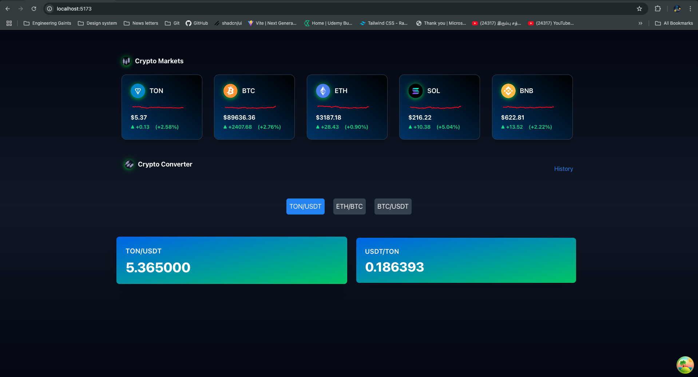

# Whale.io - RnD

[Demo](https://drive.google.com/file/d/172tml02IfdjRLYOoadagelK4NRkIU39v/view?usp=sharing)

## Overview

[requirements](./Test Assignment for Senior FullStack Developer.pdf)

This project consists of a frontend and a backend. The frontend is built with [React] and the backend is built with [Node.js/Express/Redis/MongoDB]. You can run both the frontend and backend locally, or you can run them together in Docker containers.

## Prerequisites

Before running the project locally or in Docker, ensure you have the following installed:

- [Node.js](https://nodejs.org/) (Recommended version: v18+)
- [Docker](https://www.docker.com/get-started)

## More information

Find the detailed information in respective folders

- [Frontend](./frontend/README.md)
- [Backend](./backend/README.md)

## Running Locally

1. Run in local

Before running the project locally spin the mongodb and redis docker containers
In backend folder

```bash
docker-compose up --build -d
```

2. Accessing the site

Frontend

```bash
http://localhost:5173/
```

Backend

```bash
http://localhost:5001/
```

3. Run e2e test

Once local is up and running

[More info](./e2e/README.md)

```bash
cd e2e
npm install
npm run test
```

4. Preview



5. Improvements

- Real-time Data with WebSockets: To improve the responsiveness of price updates, implementing WebSockets could be a better option than traditional HTTP requests.

- Optimizing Performance with Svelte or Vue: While React offers a robust framework, switching to Svelte or Vue could further enhance performance.

- API documentation

- Efficient Data Caching with Redis: Even though we have recent information in redis with TTL of 30 mins. Instead of fetching data directly from external providers every time, we could periodically query backend endpoints to update Redis with fresh data. This would allow the frontend to access cached responses directly from Redis, improving response times and reducing call to the external data provider.
